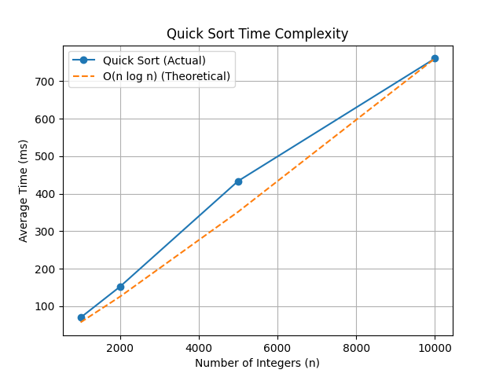

# Quick Sort (Divide and Conquer)

## Aim
To sort a given array using the Quick Sort algorithm and analyze its time complexity using execution time graphs.

---

## Algorithm Used
**Quick Sort** using **Hoare-style partitioning**, where the first element is chosen as the pivot.

---

## Pseudocode
ALGO QuickSort(arr, low, high)
IF low < high
p ← Partition(arr, low, high)
QuickSort(arr, low, p)
QuickSort(arr, p + 1, high)
END IF
END ALGO

ALGO Partition(arr, low, high)
pivot ← arr[low]
i ← low
j ← high

REPEAT
    REPEAT
        i ← i + 1
    UNTIL arr[i] > pivot

    REPEAT
        j ← j − 1
    UNTIL arr[j] ≤ pivot

    IF i < j
        SWAP arr[i], arr[j]
    END IF
UNTIL i ≥ j

SWAP arr[low], arr[j]
RETURN j
END ALGO


---

## Variables Used
- **arr[]** — Input array  
- **low** — Lower index  
- **high** — Higher index  
- **pivot** — Pivot element  
- **i, j** — Partition pointers  

---

## Algorithm Explanation
Quick Sort follows the **divide and conquer** paradigm.  
The array is partitioned around a pivot such that elements smaller than the pivot are placed on the left and larger elements on the right.  
This process is applied recursively to the subarrays until the entire array is sorted.

---

## Time Complexity
- **Best Case:** `O(n log n)`  
- **Average Case:** `O(n log n)`  
- **Worst Case:** `O(n²)` (when pivot selection is poor)

---

## Space Complexity
**O(log n)** (due to recursion stack)

---

## Graph Analysis (Time Complexity vs Input Size)

The execution time of Quick Sort is measured for different input sizes.
Each case is executed **1000 times**, and the **average execution time** is recorded in milliseconds.

The graph plots:
- **X-axis:** Number of elements (n)
- **Y-axis:** Average execution time (ms)

The experimental curve closely follows the theoretical **O(n log n)** growth.

## Graph Output



---

## Files Generated
| File Name | Description |
|---------|-------------|
| `quick_sort.cpp` | C++ program with time measurement |
| `quick_sort.csv` | Stores (n, average time) values |
| `quick_sort.py` | Python script to generate graph |

---

## How to Compile and Run (C++)
```bash
g++ quick_sort.cpp -o quick_sort
./quick_sort
This generates the file:

quick_sort.csv
How to Generate the Graph (Python)
Make sure quick_sort.csv and quick_sort.py are in the same folder.

python quick_sort.py
A graph showing Quick Sort time complexity will be displayed using matplotlib.

Graph Interpretation
The curve increases faster than linear but slower than quadratic.

This confirms the average-case O(n log n) time complexity.

Minor deviations are due to system overhead and random input variation.

Applications
Efficient sorting of large datasets

Widely used in practical systems

Demonstrates divide-and-conquer strategy

Conclusion
Quick Sort is one of the fastest sorting algorithms in practice due to its efficient average-case performance and low memory overhead.
